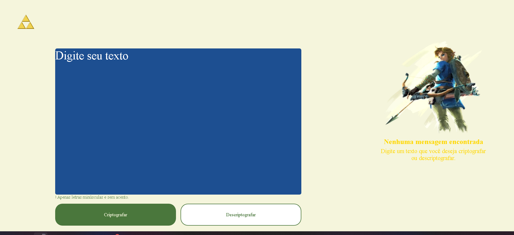

# Desafio-Alura-Decodificador
Desafio proposta pela Alura de Criar um decodificador de Texto

# Projeto de Criptografia e Descriptografia de Texto

Este projeto consiste em um simples aplicativo web que permite criptografar e descriptografar textos usando substituições de caracteres específicas.

## Funcionalidades

- **Criptografar Texto**: Substitui certas letras por sequências de caracteres predefinidas.
- **Descriptografar Texto**: Reverte o processo de criptografia para recuperar o texto original.
- **Verificação de Texto**: Garante que o texto de entrada não contenha letras maiúsculas ou acentos.
- **Copiar Texto**: Permite copiar o texto criptografado ou descriptografado para a área de transferência.

## Como Usar

1. **Criptografar Texto**:
    - Digite seu texto na área de entrada.
    - Clique no botão "Criptografar".
    - O texto criptografado aparecerá na área de saída e será copiado automaticamente para a área de transferência.

2. **Descriptografar Texto**:
    - Digite o texto criptografado na área de entrada.
    - Clique no botão "Descriptografar".
    - O texto descriptografado aparecerá na área de saída e será copiado automaticamente para a área de transferência.

## Detalhes Técnicos

### Funções Principais

- **botãoCriptografar**: Verifica se o texto de entrada está livre de letras maiúsculas e acentos. Em caso afirmativo, alerta o usuário; caso contrário, criptografa o texto, atualiza a área de saída e copia o texto para a área de transferência.
  
- **copiarTexto**: Copia o texto fornecido para a área de transferência do navegador.

- **codificarTexto**: Substitui as letras 'a', 'e', 'i', 'o', 'u' por 'ai', 'enter', 'imes', 'ober', 'ufat', respectivamente.

- **botaoDescriptografar**: Similar ao botãoCriptografar, mas reverte a criptografia.

- **descodificarTexto**: Reverte o processo de criptografia substituindo as sequências 'ai', 'enter', 'imes', 'ober', 'ufat' pelas letras originais.

- **VerificarTexto**: Verifica se o texto contém letras maiúsculas ou acentos.

- **mostrarButton**: Exibe o botão de copiar.

### Regras de Criptografia

- 'a' é substituído por 'ai'
- 'e' é substituído por 'enter'
- 'i' é substituído por 'imes'
- 'o' é substituído por 'ober'
- 'u' é substituído por 'ufat'

### Regras de Descriptografia

- 'ai' é revertido para 'a'
- 'enter' é revertido para 'e'
- 'imes' é revertido para 'i'
- 'ober' é revertido para 'o'
- 'ufat' é revertido para 'u'

## Estrutura do Projeto

- `index.html`: Contém a estrutura HTML da página.
- `styles.css`: Contém os estilos CSS da página.
- `script.js`: Contém o código JavaScript do projeto.

## Requisitos

- Navegador web moderno (Chrome, Firefox, Edge, etc.)

## Como Executar

1. Clone este repositório.
2. Abra o arquivo `index.html` no seu navegador.

## imagem do Projeto

